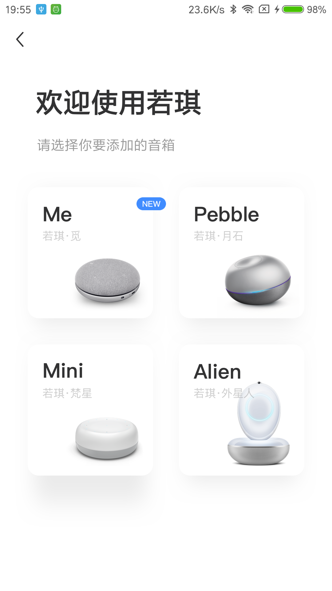
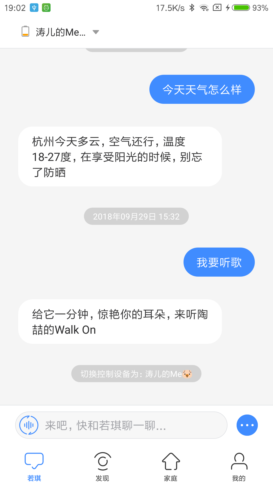
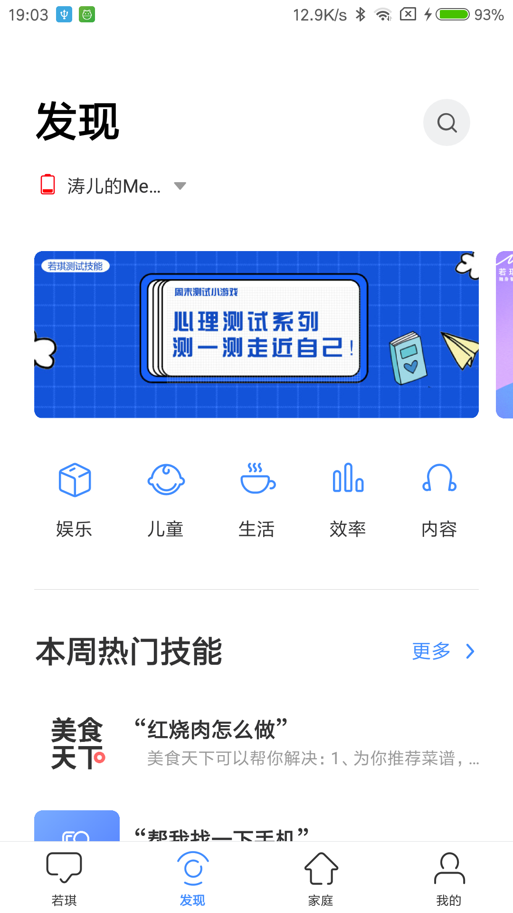
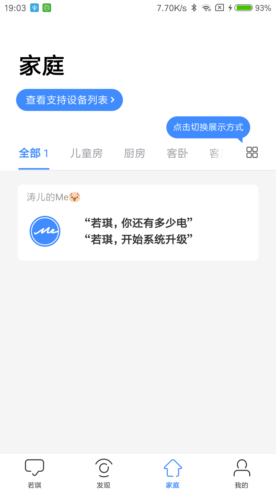
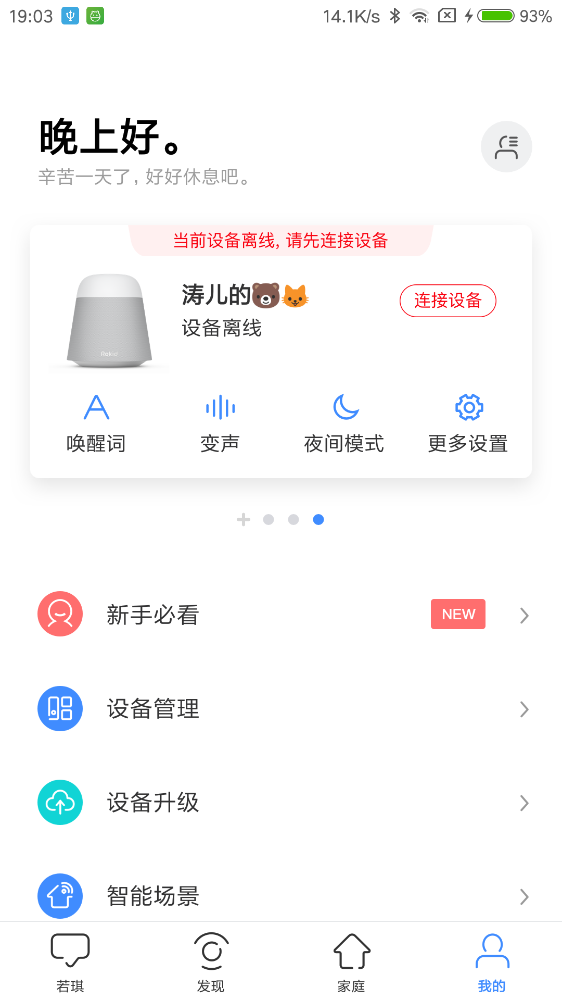

# 若琪联盟 APP 介绍

## 什么是 若琪联盟 APP

若琪联盟 APP 直接可以对 搭载 Rokid服务的设备配网、指令发送、技能控制、ioT、设备管理等交互能力。 

目前支持手机系统有：iOS（苹果）、Android（安卓）。

# 公版APP
公版APP主要由4个模块构成，分别是若琪模块、发现模块、家庭模块和我的模块，具体如图所示：

绑定模块

若琪模块首页

发现模块首页

家庭模块首页

我的模块首页

## 文档介绍

本文档主要介绍了 若琪联盟 APP 各个模块的使用说明 和 功能介绍。

本文档统一称 若琪联盟 APP 为 若琪联盟

## 支持

[若琪联盟 APP Issue](https://github.com/Rokid/mobile-alliance-docs/issues)

